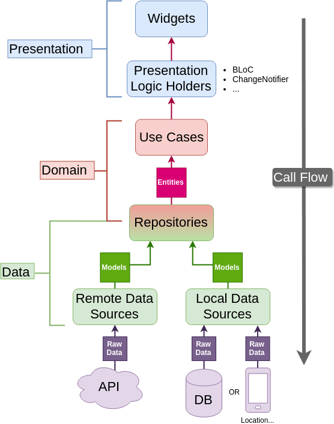

<h1>chat app</h1>

<h3>Developed a cross-platform mobile app for chat using Flutter. </h3>
<h3>Implemented Bloc state management and clean architecture to enhance user experience and maintain scalable code.</h3>
<h3>Integrated Firebase for real-time messaging and user authentication.</h3>
<h3>Technologies used: Flutter, Firebase, Bloc</h3>

